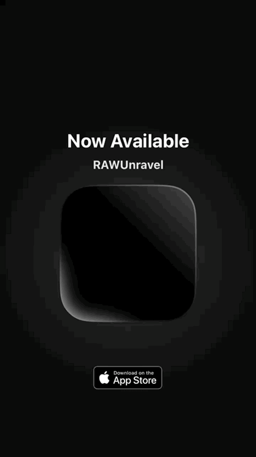

### Hi there 👋

<a href="https://apps.apple.com/us/app/rawunravel/id6749280635"></img></a>
<a href="https://apps.apple.com/us/app/hilbertcam/id6795487248"></img></a>

<a href="https://github.com/Benitoite/rawunravel">RAWUnravel- free open source RAW developer.</a> 
<a href="https://github.com/Benitoite/hilbertcam">HilbertCam- free open source Hilbert curve video processor.</a>
 

- 🔭 I’m currently working on
- https://r42.us/nixie/box/black using javascript
- 🔭 I’m currently working on https://github.com/Beep6581/RawTherapee/tree/dev/tools/osx using cmake, bash, zsh, github actions, and some c++ here and there.
- 👯 https://github.com/Beep6581/RawTherapee/commits/dev/tools/osx
- 💬 Ask me about MacOS app bundle builds via CL

- ⚡ Fun fact: Have played bassoon in a professional symphony for the union.  
- ⚡ Fun fact: Have played bassoon in a quintet for the International Council of Mayors at the UN Library in SF with Al Gore in attendance.  
- ⚡ Fun fact: Have played bassoon in a local community college band at a building dedication with Al Gore in attendance.  
- ⚡ Fun fact: Have played bassoon during the July 4th fireworks show at Pismo Beach with the USAF band carrying orders signed by *The Governator* Arnold Schwarzenegger. 

- 🌱 I’m currently learning C++

- 📫 How to reach me: kd6kxr@gmail.com

- 🔭 [PATREON / Benitoite](https://www.patreon.com/Benitoite) Support macOS photography software builds.

<!--
**Benitoite/Benitoite** is a ✨ _special_ ✨ repository because its `README.md` (this file) appears on your GitHub profile.

Here are some ideas to get you started:

- 🔭 I’m currently working on ...
- 🌱 I’m currently learning ...
- 👯 I’m looking to collaborate on ...
- 🤔 I’m looking for help with ...
- 💬 Ask me about ...
- 📫 How to reach me: ...
- 😄 Pronouns: ...
- ⚡ Fun fact: ...
-->
